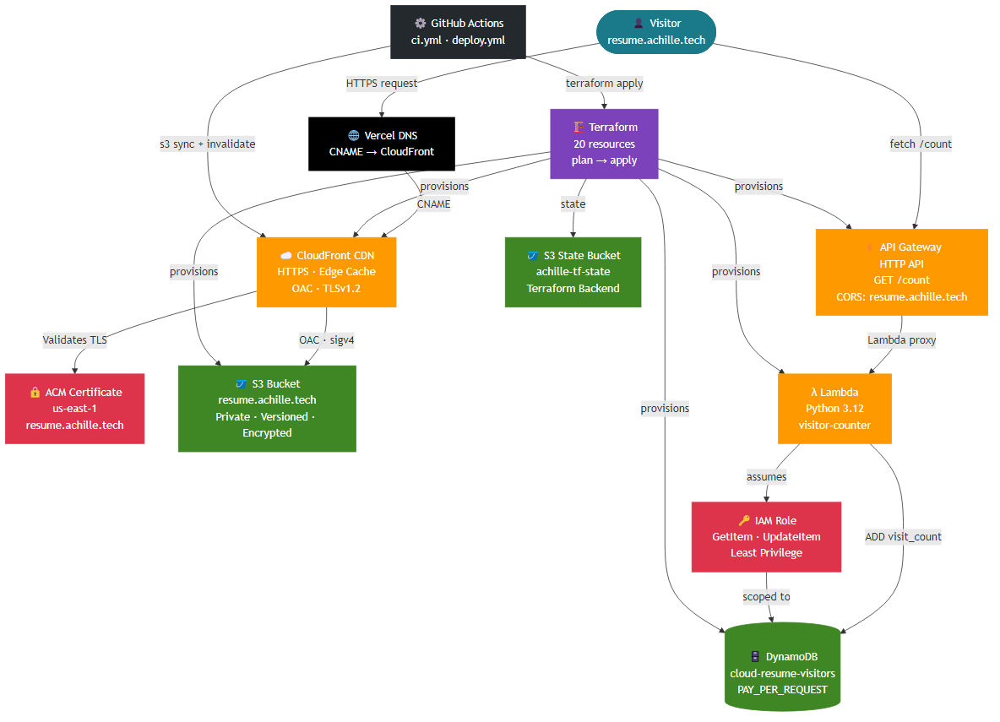

# cloud-resume-infra

> Production-grade static resume site on AWS — fully provisioned with Terraform, serverless visitor counter, automated CI/CD via GitHub Actions.

**Live at [resume.achille.tech](https://resume.achille.tech)**


---

## Architecture



| Layer | Service | Purpose |
|-------|---------|---------|
| CDN | CloudFront | HTTPS termination, edge caching, OAC |
| Storage | S3 | Static site hosting, private, versioned |
| TLS | ACM (us-east-1) | SSL certificate for CloudFront |
| Serverless | Lambda (Python 3.12) | Visitor counter — atomic DynamoDB increment |
| Database | DynamoDB | Visitor count persistence, PAY_PER_REQUEST |
| API | API Gateway HTTP API | `GET /count` endpoint, CORS scoped to origin |
| IAM | Least-privilege role | Lambda: `GetItem` + `UpdateItem` only |
| IaC | Terraform | All 20 resources, S3 remote state |
| CI/CD | GitHub Actions | Validate on PR, deploy on merge to main |
| DNS | Vercel DNS | CNAME `resume` → CloudFront distribution |

---

## Prerequisites

- [Terraform](https://terraform.io) >= 1.7
- [AWS CLI](https://aws.amazon.com/cli/) v2
- AWS IAM user with deployment permissions
- S3 bucket for Terraform state (see setup below)
- Domain in Vercel DNS (or Route 53 — see note)

---

## First-time setup

### 1. Create the Terraform state bucket

```bash
aws s3api create-bucket --bucket <your-state-bucket> --region us-east-1
aws s3api put-bucket-versioning \
  --bucket <your-state-bucket> \
  --versioning-configuration Status=Enabled
aws s3api put-bucket-encryption \
  --bucket <your-state-bucket> \
  --server-side-encryption-configuration \
  '{"Rules":[{"ApplyServerSideEncryptionByDefault":{"SSEAlgorithm":"AES256"}}]}'
```

### 2. Update the backend config

Edit `infra/main.tf` and set your state bucket name:

```hcl
backend "s3" {
  bucket  = "<your-state-bucket>"
  key     = "cloud-resume/terraform.tfstate"
  region  = "us-east-1"
  encrypt = true
}
```

### 3. Configure variables

Edit `infra/variables.tf` or export as env vars:

```bash
export TF_VAR_domain_name="yourdomain.com"
export TF_VAR_resume_subdomain="resume.yourdomain.com"
```

### 4. Deploy infrastructure

```bash
export AWS_PROFILE=your-profile
cd infra
terraform init
terraform plan
terraform apply
```

After apply, note the outputs:

```
cloudfront_url             = "xxxx.cloudfront.net"
cloudfront_distribution_id = "XXXXXXXXXXXXX"
s3_bucket_name             = "resume.yourdomain.com"
api_endpoint               = "https://xxxx.execute-api.us-east-1.amazonaws.com/count"
acm_validation_records     = { ... }  # Add this CNAME in your DNS provider
```

### 5. DNS setup (Vercel)

Add two records in your DNS provider:

| Name | Type | Value |
|------|------|-------|
| `_<acm-token>.resume` | CNAME | `_<validation>.acm-validations.aws.` |
| `resume` | CNAME | `<cloudfront_url>` |

> **Note:** If your DNS provider auto-creates CAA records for subdomains, add `0 issue "amazon.com"` to both the subdomain and root domain CAA records before running `terraform apply`. Otherwise ACM validation will fail with `CAA_ERROR`.

### 6. Deploy the frontend

```bash
cd path/to/your/frontend
VITE_API_BASE_URL=https://your-api.onrender.com \
VITE_VISITOR_COUNTER_URL=https://xxxx.execute-api.us-east-1.amazonaws.com/count \
npm run build

aws s3 sync dist/ s3://resume.yourdomain.com --delete
aws cloudfront create-invalidation \
  --distribution-id XXXXXXXXXXXXX \
  --paths "/*"
```

---

## CI/CD

### `ci.yml` — runs on every PR

Three parallel jobs:

| Job | Steps |
|-----|-------|
| Terraform | `init` → `fmt -check` → `validate` → `plan` (artifact saved) |
| Lambda tests | `pytest lambda/tests/` — mocked DynamoDB, no AWS needed |
| Frontend | Checkout `achille.dev` → ESLint → `npm run build` |

### `deploy.yml` — runs on merge to `main`

Single job:

```
terraform apply → checkout frontend → npm install → npm run build → s3 sync → cloudfront invalidation
```

### Required GitHub secrets

| Secret | Description |
|--------|-------------|
| `AWS_ACCESS_KEY_ID` | IAM deployer access key |
| `AWS_SECRET_ACCESS_KEY` | IAM deployer secret key |

### Required GitHub variables

| Variable | Example |
|----------|---------|
| `TF_VAR_DOMAIN_NAME` | `achille.tech` |
| `TF_VAR_RESUME_SUBDOMAIN` | `resume.achille.tech` |
| `VITE_API_BASE_URL` | `https://resume-platform-api.onrender.com` |
| `VITE_VISITOR_COUNTER_URL` | `https://xxxx.execute-api.us-east-1.amazonaws.com/count` |
| `CLOUDFRONT_DISTRIBUTION_ID` | `E6K0II6W1RZ0I` |
| `S3_BUCKET` | `resume.achille.tech` |

---

## Repository structure

```
cloud-resume-infra/
├── .github/
│   └── workflows/
│       ├── ci.yml          # validate + plan + test on PR
│       └── deploy.yml      # apply + deploy on merge to main
├── infra/
│   ├── main.tf             # provider, S3 backend
│   ├── variables.tf        # all input variables
│   ├── outputs.tf          # CloudFront URL, bucket, API endpoint
│   ├── s3.tf               # S3 bucket, versioning, encryption, public access block
│   ├── cloudfront.tf       # CloudFront distribution + OAC + S3 bucket policy
│   ├── acm.tf              # ACM certificate (us-east-1) + validation
│   ├── dynamodb.tf         # visitor counter table
│   ├── iam.tf              # Lambda execution role, least-privilege policy
│   └── lambda.tf           # Lambda function + API Gateway HTTP API
├── lambda/
│   ├── handler.py          # visitor counter — atomic DynamoDB increment
│   └── tests/
│       └── test_handler.py # 4 unit tests, mocked DynamoDB
├── docs/
│   └── architecture.png
├── interview.md            # STAR-format interview prep for this project
└── README.md
```

---

## Lambda visitor counter

The counter uses an atomic `ADD` expression — no race condition under concurrent requests:

```python
table.update_item(
    Key={"id": "visitors"},
    UpdateExpression="ADD visit_count :inc",
    ExpressionAttributeValues={":inc": 1},
    ReturnValues="UPDATED_NEW",
)
```

CORS is explicitly scoped — not a wildcard:

```python
"Access-Control-Allow-Origin": f"https://{os.environ.get('ALLOWED_ORIGIN', '*')}"
```

Run tests locally:

```bash
cd lambda
pip install boto3 pytest
python -m pytest tests/ -v
```

---

## Security notes

- S3 bucket has all public access blocked — CloudFront OAC handles all object reads
- CloudFront enforces HTTPS redirect — no HTTP-only access
- ACM certificate minimum TLS version: `TLSv1.2_2021`
- Lambda IAM role: `GetItem` + `UpdateItem` on one table ARN only
- CORS: explicit origin, not `*`
- Terraform state: encrypted at rest in S3 with versioning

---

## License

[MIT](./LICENSE) © 2025 Ali Achille Traore | [achille.tech](https://achille.tech)
